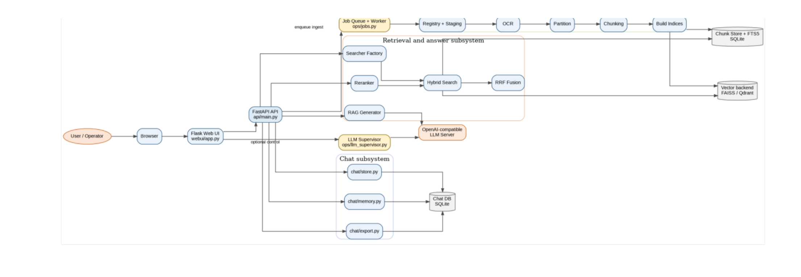
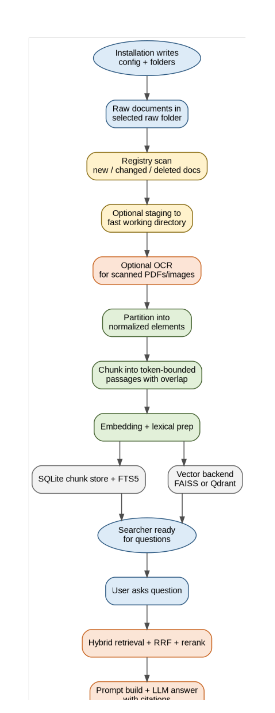
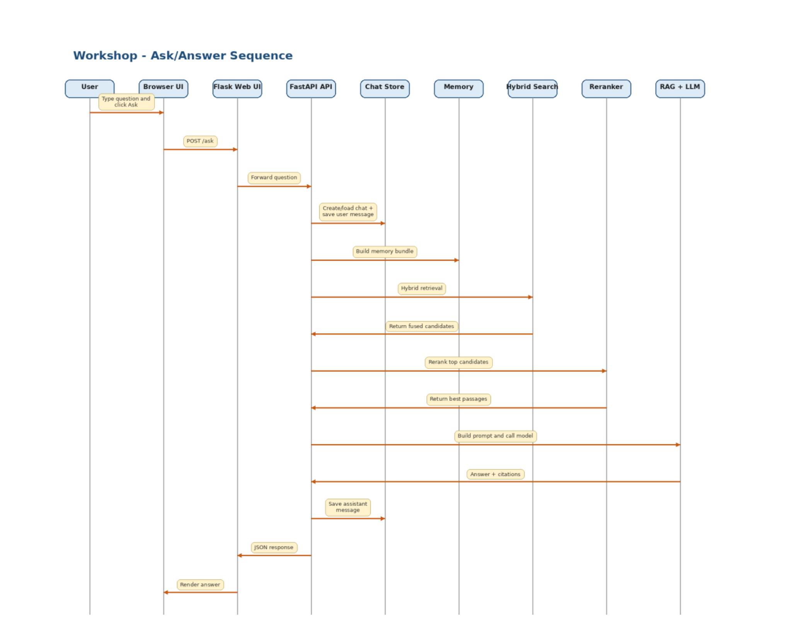
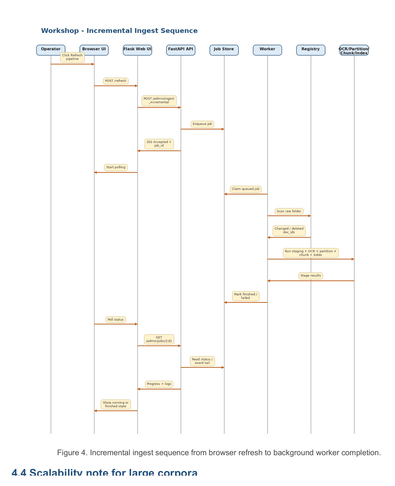

# Architecture

The Knowledge Base is deliberately layered. The Web UI handles operator interaction, the FastAPI backend acts as the control plane, the ingest subsystem converts raw files into search artifacts, retrieval and reranking transform a question into candidate evidence, and the RAG layer turns evidence into a cited answer.

## Service topology

| Layer / service | Responsibility | Default port |
|---|---|---:|
| Flask Web UI | Browser interface, status cards, refresh controls, ask view and chat controls. | 5000 |
| FastAPI backend | Health endpoints, ingest job control, retrieval, reranking, chat persistence and ask endpoints. | 8000 |
| LLM server | Local OpenAI-compatible inference endpoint for RAG answer generation. | 8001 |
| Optional supervisor | Lifecycle control for the LLM process, health probes, restart and breaker logic. | 8002 |

## Component architecture

The component view shows four main responsibilities:

1. **Operator and UI layer** - the user works in the browser through the Flask Web UI.
2. **Control plane** - FastAPI coordinates ingest, retrieval, chat and generation flows.
3. **Search artifact pipeline** - registry, OCR, partitioning, chunking and indexing prepare the searchable corpus.
4. **RAG answer pipeline** - hybrid search, reciprocal rank fusion, reranking, prompt construction and local LLM generation produce grounded answers.

## Data lifecycle: raw input to searchable knowledge

The system does not search the raw folder directly. New, changed or deleted documents are detected through a registry scan. The pipeline may stage files into a fast working directory, run OCR for scanned PDFs and images, partition documents into normalized elements, chunk text into retrieval-sized passages, prepare embeddings and lexical features, then update the chunk store plus lexical and vector search structures.

The final search layer can use a SQLite chunk store with FTS5 and a vector backend such as FAISS or Qdrant. This separation makes the pipeline inspectable and avoids circular processing.

## Ask-time sequence

At ask time, the browser sends the question to the Web UI, which forwards it to the backend. The backend creates or reuses a chat, stores the user turn, builds a memory bundle when needed, retrieves relevant candidates, reranks the best passages, constructs an evidence-based prompt and calls the local model server. The answer is stored back into the chat and returned to the browser.

## Incremental ingest sequence

The incremental ingest sequence is designed for operational reliability. The Web UI triggers the refresh, the backend queues a job, a worker claims it, the registry identifies changed or deleted documents and the ingest/index pipeline updates the processed artifacts. The UI polls for job status and displays progress until completion.

## Storage layers

The system intentionally uses multiple storage layers because each solves a different problem:

| Storage layer | Purpose |
|---|---|
| Raw folder | Original documents maintained by users. |
| OCR outputs | Extracted text from scanned PDFs/images. |
| Parsed elements | Normalized document elements before chunking. |
| Chunk records | Retrieval-sized passages with metadata. |
| Lexical index | Exact/sparse term retrieval such as FTS5/BM25. |
| Vector backend | Semantic retrieval with dense embeddings. |
| Chat store | Conversation continuity, memory and transcript export. |

This is more complex than a single database, but it makes the system debuggable, replaceable in parts and easier to operate at scale.

## Debugging order

A useful debugging strategy is to follow responsibility boundaries:

- UI problems: inspect the Flask UI layer and browser assets first.
- Green status but weak answers: inspect chunking, retrieval and reranking before changing prompts.
- No answer generation: inspect LLM readiness and the RAG client/generation path.
- Fresh documents missing from answers: inspect registry scan, job runner, chunking and index build in that order.
